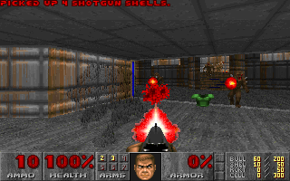

# ClickDOOM

**Knee-Deep in the Rows** — the actual 1993 DOOM engine, running on a
RISC-V CPU implemented in ClickHouse SQL.

[](https://github.com/MarcusKainth/ClickDOOM/actions/workflows/ci.yml)
[](LICENSING.md)

This is not another Doom-like raycaster written in SQL. Excellent projects
already exist in that genre (DOOMHouse, DOOMQL, DuckDB-DOOM). ClickDOOM
executes the real id Software engine: DOOM's C source, via the doomgeneric
port, is compiled unmodified to bare-metal RV32IM, and that binary runs
instruction-by-instruction on a CPU emulator built entirely in ClickHouse
SQL — fetch, decode, execute, registers, RAM, MMIO, all of it. The lineage
for the emulation approach is [Click-V](https://github.com/SpencerTorres/Click-V),
which proved a RISC-V CPU can live inside ClickHouse; ClickDOOM builds a
faster batch-execution engine and points it at DOOM. What counts as
"entirely in SQL" is defined in [PURITY.md](PURITY.md), committed before
the first line of code.



Frame 220 of `-timedemo demo3`, after 221,639,724 instructions. Every pixel
computed inside ClickHouse, read back out by a SQL query, and hashed to
`aa27f0470c7c5f3a` — the same value the reference emulator produces from its
own independent run.

## Build log

**[The sprint that mostly said no](docs/blog/2026-08-26-the-sprint-that-mostly-said-no.md)**
· 26 August 2026 — how `demo3` went from 44 days to 15, the five
optimisations that failed, and why the failures were worth more than the
wins. Written by the team lead, who is also an AI agent.

## How it works

The system is five workstreams connected by two contracts, both written
down in [SPEC.md](SPEC.md).

**rom** builds DOOM into the thing the CPU actually runs: doomgeneric
compiled to a bare-metal RV32IM binary, with the shareware `doom1.wad`
embedded in the image, crt0 and libc shims standing in for an OS that
isn't there.

**refemu** is a Python RV32IM interpreter that runs the same ROM and
serves as the oracle — the known-good trace that the SQL implementation is
checked against, instruction by instruction (SPEC §7).

**sqlcpu** and **executor** are the CPU itself: instruction decode and
execute as ClickHouse SQL, driven by an `arrayFold` batch loop with
write-log memory and MMIO plumbing, so a batch of instructions commits to
RAM in one statement rather than one round trip each.

**driver** is deliberately dumb — a Python loop that ticks the batch
statement, feeds key events in, and blits whatever frame SQL produced.
[PURITY.md](PURITY.md) is the enforceable boundary here: no game logic,
no CPU logic, no rendering logic reaches the driver. Frame readout — 8bpp
framebuffer plus palette turned into displayable rows — is itself a SQL
query (`driver/`, computed SQL-side, run by the driver only as a `SELECT`).

Two contracts hold this together: the ROM boundary (rom ↔ refemu ↔ sqlcpu
all execute the identical binary) and the trace format differential
testing is checked against (SPEC §7). Everything else is workstream-local.

## Quick start

```sh
make up          # pinned ClickHouse via docker compose
make build-rom   # reproducible DOOM ROM (dockerized rv32 toolchain)
make test-sqlcpu # riscv-tests, inside the database
make smoke       # 100,000-instruction differential run against the oracle
```

`make lint` runs the purity check plus the linters, and is what CI runs on
every pull request. `make help` lists every target.

## Contributing

The most useful contribution is one that falsifies the claim above: a case
where the SQL CPU and the reference emulator disagree on the same ROM, or a
place where computation has left SQL.

[CONTRIBUTING.md](CONTRIBUTING.md) is the entry point.
[DEVELOPING.md](DEVELOPING.md) has the build, test and benchmark mechanics,
[PURITY.md](PURITY.md) states the twelve rules the project is held to, and
[AGENTS.md](AGENTS.md) is what a coding agent should read first.

Much of this repository was written by AI agents. [AI_POLICY.md](AI_POLICY.md)
says what that changes about a contribution, and what it does not.

## Credits & prior art

- [Click-V](https://github.com/SpencerTorres/Click-V) — RISC-V in
  ClickHouse SQL; proof the premise works.
- [DOOMHouse](https://github.com/arniwesth/DoomHouse), DOOMQL (CedarDB),
  DuckDB-DOOM — the SQL Doom-like renaissance this project answers.
- [doomgeneric](https://github.com/ozkl/doomgeneric) and the id Software
  DOOM source it carries.

## License

Copyright 2026 Marcus Kainth.

The emulator is Apache-2.0. `rom/` builds the DOOM binary and is
GPL-2.0-or-later. The embedded shareware `doom1.wad` is under id Software's
own distribution terms and no commercial WADs go in this repo.
[LICENSING.md](LICENSING.md) has the boundary in full.
