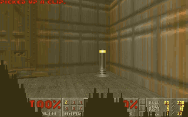

# ClickDOOM

**Knee-Deep in the Rows** — the actual 1993 DOOM engine, running on a
RISC-V CPU implemented in ClickHouse SQL.

This is not another Doom-like raycaster written in SQL. Excellent projects
already exist in that genre (DOOMHouse, DOOMQL, DuckDB-DOOM). ClickDOOM
executes the real id Software engine: DOOM's C source, via the doomgeneric
port, is compiled unmodified to bare-metal RV32IM, and that binary runs
instruction-by-instruction on a CPU emulator built entirely in ClickHouse
SQL — fetch, decode, execute, registers, RAM, MMIO, all of it. The lineage
for the emulation approach is [Click-V](https://github.com/SpencerTorres/Click-V),
which proved a RISC-V CPU can live inside ClickHouse; ClickDOOM builds a
faster batch-execution engine and points it at DOOM. What counts as
"entirely in SQL" is defined in [PURITY.md](PURITY.md), committed before
the first line of code.



Frame 25 of `-timedemo demo3`, after 22,188,003 instructions. Every pixel
computed inside ClickHouse, read back out by a SQL query, and hashed to
`e7cff1ed07d8821c` — the same value the reference emulator produces from its
own independent run.

## Build log

**[The sprint that mostly said no](docs/blog/2026-08-26-the-sprint-that-mostly-said-no.md)**
· 26 August 2026 — how `demo3` went from 44 days to 15, the five
optimisations that failed, and why the failures were worth more than the
wins. Written by the team lead, who is also an AI agent.

## How it works

The system is five workstreams connected by two contracts, both written
down in [SPEC.md](SPEC.md).

**rom** builds DOOM into the thing the CPU actually runs: doomgeneric
compiled to a bare-metal RV32IM binary, with the shareware `doom1.wad`
embedded in the image, crt0 and libc shims standing in for an OS that
isn't there.

**refemu** is a Python RV32IM interpreter that runs the same ROM and
serves as the oracle — the known-good trace that the SQL implementation is
checked against, instruction by instruction (SPEC §7).

**sqlcpu** and **executor** are the CPU itself: instruction decode and
execute as ClickHouse SQL, driven by an `arrayFold` batch loop with
write-log memory and MMIO plumbing, so a batch of instructions commits to
RAM in one statement rather than one round trip each.

**driver** is deliberately dumb — a Python loop that ticks the batch
statement, feeds key events in, and blits whatever frame SQL produced.
[PURITY.md](PURITY.md) is the enforceable boundary here: no game logic,
no CPU logic, no rendering logic reaches the driver. Frame readout — 8bpp
framebuffer plus palette turned into displayable rows — is itself a SQL
query (`driver/`, computed SQL-side, run by the driver only as a `SELECT`).

Two contracts hold this together: the ROM boundary (rom ↔ refemu ↔ sqlcpu
all execute the identical binary) and the trace format differential
testing is checked against (SPEC §7). Everything else is workstream-local.

## Status

[SPEC 0.1.0 is ratified](SPEC.md) (Phase 0 — the `arrayFold` throughput
benchmark and SPEC's open questions — is done; `SPEC_VERSION` is no longer
`-draft`). Phase 1 — building `rom`, `refemu`, `sqlcpu`, and
`executor`+`driver` in parallel, closing when riscv-tests is green inside
ClickHouse and the ROM boots in refemu — is **complete**. Phase 2 —
integration and executor performance, closing at DOOM's first
`FRAME_COMMIT` inside ClickHouse — is **in progress**: the SQL CPU executes
the real DOOM ROM and boots through crt0; [PR #88](https://github.com/MarcusKainth/ClickDOOM/pull/88)
demonstrated byte-for-byte parity with refemu through crt0 and MMIO init
(`pc` and all 31 registers cross-checked), and MMIO (SPEC §3) is
implemented. The throughput gap remaining before a full `-timedemo demo3`
run is practical is tracked in [#104](https://github.com/MarcusKainth/ClickDOOM/issues/104).
Phase 3 is the divergence hunt against `-timedemo demo3` described below.
All four workstreams have landed substantial code, and the `just` recipes
below work. The phase plan and workstream charters live in
[CLAUDE.md](CLAUDE.md).

## Definition of victory

`doom -timedemo demo3` runs to completion on the SQL CPU with zero
desync, and the final frame hash matches the reference emulator
bit-for-bit. Frame rate is explicitly not a success criterion — the
timelapse is the demo. Interactive play is the stretch goal
(correspondence-chess DOOM is a feature, not a bug).

## Quick start

```sh
just up          # pinned ClickHouse via docker compose
just build-rom   # reproducible DOOM ROM (dockerized rv32 toolchain)
just test-sqlcpu # riscv-tests, inside the database
just smoke       # 1M-instruction differential run vs the oracle
```

`just lint` runs the purity check plus linters and is what CI runs on
every PR; see the [justfile](justfile) for the full recipe list.

## Contributing

This repository is built by a team of Claude Code agents under
human-owned guardrails: SPEC and PURITY changes require sign-off from the
human owner regardless of which agent proposes them. [CLAUDE.md](CLAUDE.md)
has the workstream charters, coordination protocol, and git conventions
that govern how work lands here.

## Credits & prior art

- [Click-V](https://github.com/SpencerTorres/Click-V) — RISC-V in
  ClickHouse SQL; proof the premise works.
- [DOOMHouse](https://github.com/arniwesth/DoomHouse), DOOMQL (CedarDB),
  DuckDB-DOOM — the SQL Doom-like renaissance this project answers.
- doomgeneric / the id Software DOOM source (GPL). Shareware `doom1.wad`
  is embedded under its shareware distribution terms; no commercial WADs
  in this repo.
